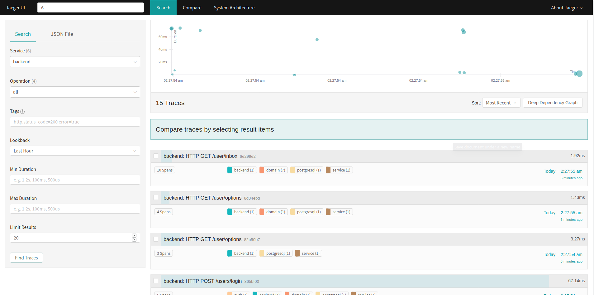
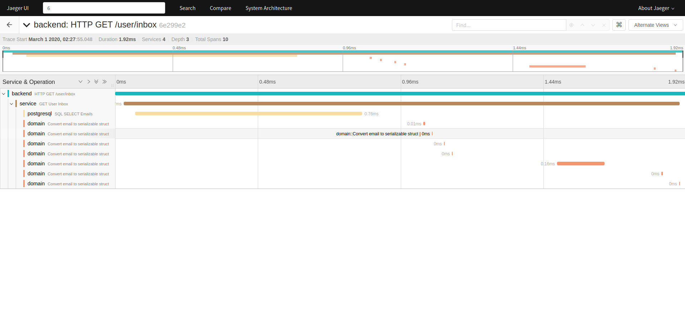

# Distributed Tracing

This application uses a template of an API server in a microservice architecture that can display how distributed tracing could be utilized in a microservice-heavy environment like BT's.

This server is built with [Rocket](https://rocket.rs), a simple, fast, and type-safe web framework for Rust. The database used is [PostgreSQL](https://www.postgresql.org/), the world's most advanced open source relational database, with [Diesel](http://diesel.rs), a safe, extensible ORM and query builder for Rust, acting as the bridge between Rocket and the database. Diesel also provides all migration management for this project.

All tracing is done with `rustracing` with `jaeger` as the visualization tool used for now.

|              Trace Search              |             Trace Details              |
| :------------------------------------: | :------------------------------------: |
|  |  |

## Getting Started

These instructions will get you a copy of the project up and running on your local machine for development and testing purposes.

### Prerequisites

```
Rust nightly
Cargo
Docker/Compose
```

### Running

To aid in the process of starting the server, I have provided a Docker Compose file for setting up the database and Jaeger, and created a container for the CLI tool used to manage migrations. From the project root, run:

```
docker-compose up --build -d
```

This will start the Postgres DB and Jaeger in the background. To populate the database, run:

```
docker run --rm \
    -v "$PWD:/volume" \
    -w /volume \
    --network="distributed-tracing_default" \
    -it ryanchristian4427/diesel-cli migration run
```

The network you use depends on the parent directory, so if the docker compose is indeed within 'distributed-tracing', the command above will work just fine. Change it if you change the directory name.

The Docker image built for diesel-cli will run "Diesel" without any arguments, making the container act like a normal CLI. However, that very large command is necessary upon every use. I therefore recommend creating an alias "docker ... /diesel-cli" to "diesel-cli" in a .bashrc or .zshrc, so the tool can be just called with "diesel-cli [command]".

To populate Jaeger with production-like data, run:

```bash
cargo test --release
```

Rust-Crypto has a massive slow down on debug builds, so it isn't recommended that you run debug at all.

## Running the tests

The unit tests and integration tests can all be ran using:

```
cargo test --release
```

The unit tests are found in the same file as the code they test, while the integration tests are found in ~/tests.

### Code Style

All formatting is done with the lovely Rustfmt, which can be ran with:

```
cargo fmt
```

The linter Clippy is also used and often its suggestions are often used, but there are some exceptions. Clippy can be ran with

```
cargo clippy
```

## Built With

* [Rocket](https://github.com/glium/glium) - A simple, fast, and type-safe web framework for Rust
* [Diesel](https://github.com/tomaka/glium_text) - A safe, extensible ORM and query builder for Rust
* [PostgreSQL](https://github.com/rustgd/cgmath) - The world's most advanced open source relational database
* [JaegerTracing](https://www.jaegertracing.io/) - Open Source, End-to-End Distributed Tracing

## Authors

* **Ryan Christian** - *Entire Project*